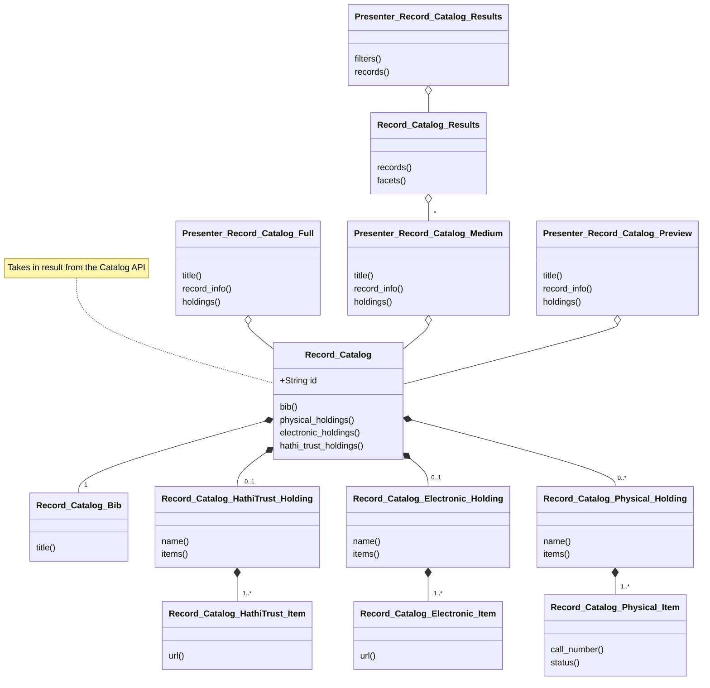

# Class Diagram for Catalog Records

```mermaid
classDiagram
   
  
    class Record_Catalog {
      +String id
      bib()
      physical_holdings()
      electronic_holdings()
      hathi_trust_holdings()
    }
    class Record_Catalog_Results {
      records()
      facets()    
    }
    class Record_Catalog_Bib {
      title()
    }
    class Record_Catalog_HathiTrust_Holding {
        name()
        items()
    }
    class Record_Catalog_HathiTrust_Item {
        url()
    }
    class Record_Catalog_Electronic_Holding {
        name()
        items()
    }
    class Record_Catalog_Electronic_Item {
        url()
    }
       class Record_Catalog_Physical_Holding {
        name()
        items()
    }
    class Record_Catalog_Physical_Item {
        call_number()
        status()
    }

    class Presenter_Record_Catalog_Results {
        filters()
        records()
    }

    class Presenter_Record_Catalog_Full {
      title()
      record_info()
      holdings()
    }
     class Presenter_Record_Catalog_Medium {
      title()
      record_info()
      holdings()
    }
     class Presenter_Record_Catalog_Preview {
      title()
      record_info()
      holdings()
    }
    
   
    Presenter_Record_Catalog_Full o-- Record_Catalog
    Presenter_Record_Catalog_Medium o-- Record_Catalog
    Presenter_Record_Catalog_Preview o-- Record_Catalog
    Presenter_Record_Catalog_Results o-- Record_Catalog_Results
    Record_Catalog_Results o-- "*" Presenter_Record_Catalog_Medium
    
    Record_Catalog *-- "1" Record_Catalog_Bib
    Record_Catalog *-- "0..1" Record_Catalog_HathiTrust_Holding
    Record_Catalog *-- "0..1" Record_Catalog_Electronic_Holding
    Record_Catalog *-- "0..*" Record_Catalog_Physical_Holding
    Record_Catalog_HathiTrust_Holding *-- "1..*" Record_Catalog_HathiTrust_Item
    Record_Catalog_Electronic_Holding *-- "1..*" Record_Catalog_Electronic_Item
    Record_Catalog_Physical_Holding *-- "1..*" Record_Catalog_Physical_Item

    note for Record_Catalog "Takes in result from the Catalog API"
```
