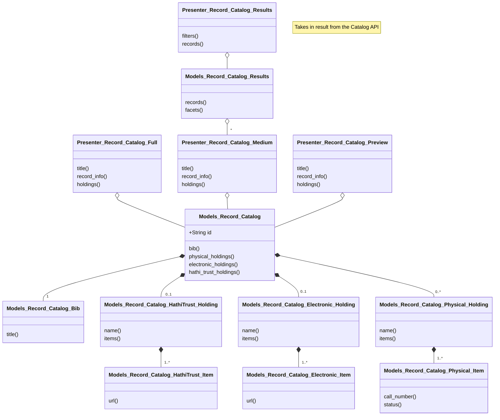

# Class Diagram for Catalog Records

## Notes

For the temporary list we will probably serialize `Record_Catalog` so it can be
generated from JSON. Or we could save the API output. That would do it, I think.
