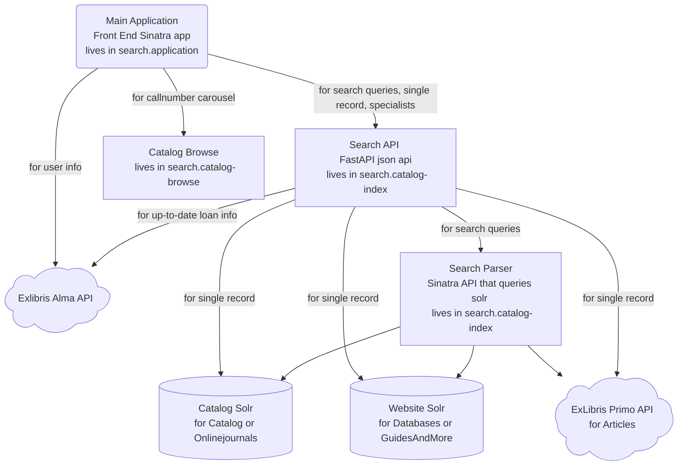

# Overall Diagram of Library Search Architecture

True as of 2026-08-11

```mermaid
flowchart TD
    A(Main Application <br> Front End Sinatra app <br> lives in search.application )
    H@{ shape: cloud, label: Exlibris Alma API}
    F@{ shape: cloud, label: "ExLibris Primo API<br>for Articles"}
    B[Search API <br> FastAPI json api <br> lives in search.catalog-index]
    C[Search Parser<br>Sinatra API that queries solr <br> lives in search.catalog-index]
    D@{ shape: cyl, label: "Catalog Solr<br>for Catalog or Onlinejournals"}
    G[Catalog Browse<br> lives in search.catalog-browse]
    E@{ shape: cyl, label: "Website Solr<br>for Databases or GuidesAndMore"}


    

    A --> |for search queries, single record, specialists| B
    A --> |for callnumber carousel| G
    A --> |for user info| H
    B -->|for search queries|C
    B --> |for up-to-date loan info| H

    B-->|for single record|D
    B-->|for single record|E
  
    C --> D
    C --> E
    C --> F
    B-->|for single record|F
```
