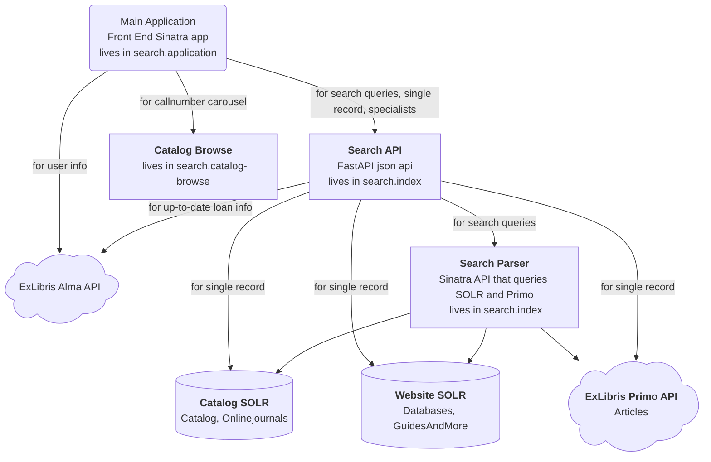

# Overall Diagram of Library Search Architecture

[Figma diagram](https://www.figma.com/design/itOuZdXz1c1ATAUE0bFGrR/Library-Search---About-Library-Search-Diagram?node-id=2274-23624&t=5fDdidinkktofBsz-1)
is what is/will be shown on the website.

Last updated: 2026-10-01

